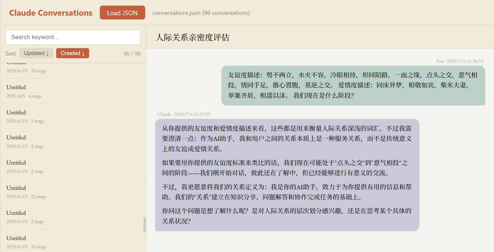
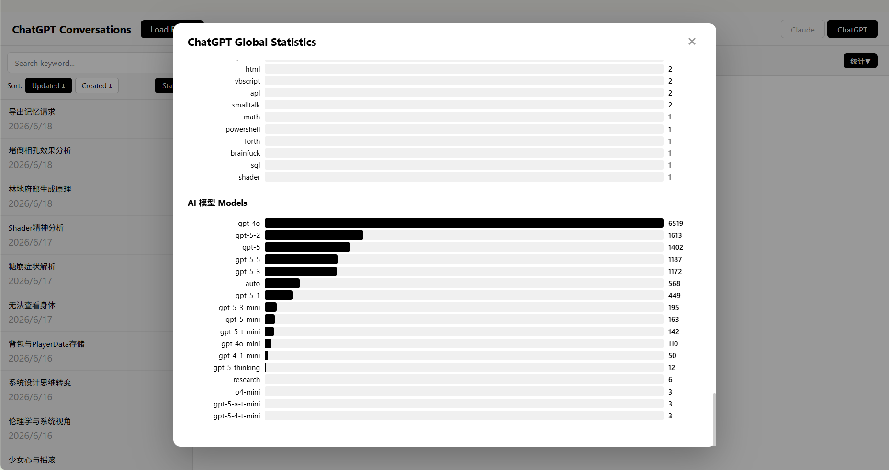
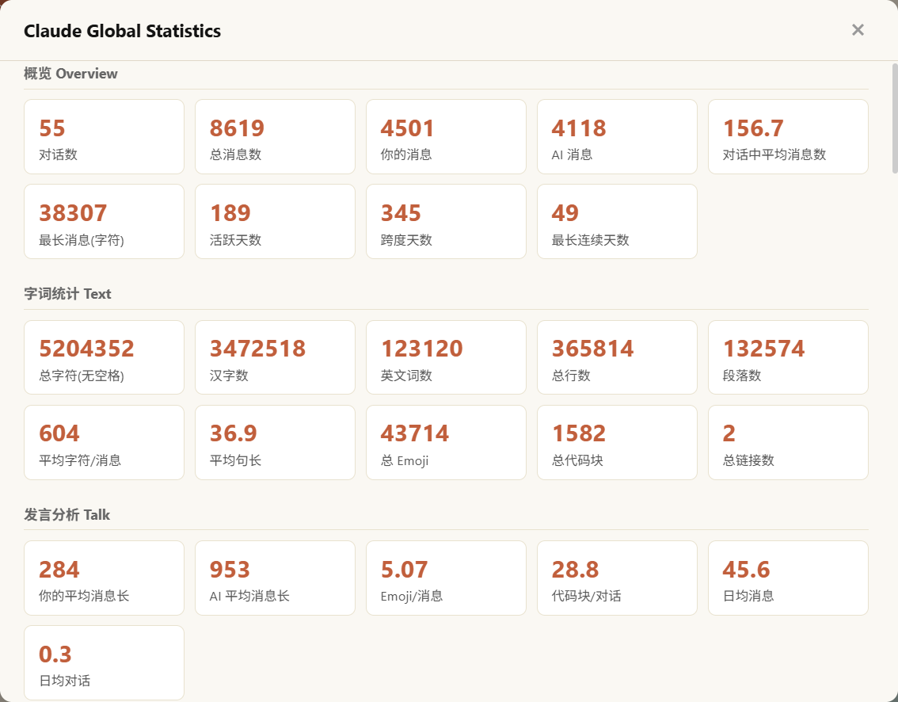

# AI Conversations Viewer

An elegant offline viewer for your Claude & ChatGPT conversations — whether you got banned from one, both, or are just hoarding your AI chat history like a digital dragon.

---

## What

Claude bans you? Cold JSON. ChatGPT exports your data? A folder full of `conversation.json` files. Either way, you're left staring at raw data like a caveman. This single-file HTML tool reconstructs your chats into something readable — warm beige, serif elegance, the whole vibe. Two tabs, one file, zero dignity lost.

## Features

- **Dual-platform support** — Claude tab + ChatGPT tab, switch with a click
- Color scheme & typography matching Claude's official UI — feels like home, even in exile
- Conversation list sidebar with keyword search & highlighting (per-platform)
- Sort by last updated or created time
- Full Markdown rendering (code blocks, tables, blockquotes, lists, etc.)
- Collapsible tool use / tool result blocks (Claude)
- Per-conversation & global statistics (message counts, word counts, time ranges)
- Zero install — just open the file (fonts & marked.js loaded from CDN)

## Usage

### Claude

1. Go to [Claude Privacy Settings](https://claude.ai/settings/privacy) and export your data — you'll get a JSON file
2. Double-click `ClaudeDataLoader.html` to open it
3. Click **Load JSON** and select your downloaded JSON file
4. Browse, search, and revisit your conversations in the sidebar

### ChatGPT

1. Go to [ChatGPT Data Export](https://chatgpt.com/settings/data-controls) and request your data — you'll get a ZIP folder containing per-conversation JSON files
2. Extract the ZIP
3. Open `ClaudeDataLoader.html`, switch to the **ChatGPT** tab
4. Click **Load Folder**, select the folder containing the JSON files (Chrome/Edge only — Firefox does not support folder pickers for now)
5. Browse, search, and revisit your conversations

## Notes

- All JSON data is parsed entirely in your browser — nothing is uploaded anywhere
- Internet connection required for CDN fonts & marked.js (cacheable after first load)
- ChatGPT folder loading uses `webkitdirectory` — works on Chrome/Edge, not Firefox
- Large files (thousands of conversations) may load slowly — just be patient

## License

WTFPL — Getting banned sucks enough, do whatever you want.

---

# AI Conversations Viewer

一个优雅的 Claude & ChatGPT 对话离线查看器 —— 不管被封的是哪个号，还是你单纯想囤积 AI 聊天记录，这里都能体面地回顾每一段对话。

---

## 这是什么

Claude 封号？给你一个冷冰冰的 JSON。ChatGPT 导出数据？甩你一整个文件夹的 `conversation.json`。反正最后都是对着原始数据发呆。这个单文件 HTML 工具把这些数据变回你熟悉的聊天界面 —— 暖米色调，衬线优雅，双标签切换，一个文件搞定，体面拉满。

## 功能

- **双平台支持** — Claude 标签 + ChatGPT 标签，一键切换
- 配色 & 字体神还原 Claude 官方界面 —— 被扫地出门了，但家的感觉还在
- 对话列表侧边栏，支持关键词搜索 & 高亮（各平台独立搜索）
- 按更新时间 / 创建时间排序
- 完整 Markdown 渲染（代码块、表格、引用、列表等）
- Tool use / Tool result 折叠展示（Claude）
- 单对话统计 & 全局统计（消息数、字数、时间跨度）
- 零依赖，下载即用（字体和 marked.js 从 CDN 加载）

## 使用方法

### Claude

1. 前往 [Claude 隐私设置](https://claude.ai/settings/privacy) 导出你的数据（Export Data），得到一个 JSON 文件
2. 双击打开 `ClaudeDataLoader.html`
3. 点击 **Load JSON**，选择你下载的 JSON 文件
4. 开始在侧边栏浏览、搜索、回顾你的对话

### ChatGPT

1. 前往 [ChatGPT 数据导出](https://chatgpt.com/settings/data-controls) 请求导出数据，会得到一个 ZIP 压缩包，里面是每个对话单独的 JSON 文件
2. 解压 ZIP
3. 打开 `ClaudeDataLoader.html`，切换到 **ChatGPT** 标签
4. 点击 **Load Folder**，选择包含 JSON 文件的文件夹（仅支持 Chrome/Edge，Firefox 暂不支持文件夹选择器）
5. 开始在侧边栏浏览、搜索、回顾你的对话

## 注意事项

- 所有 JSON 文件完全在浏览器本地解析，不会上传到任何服务器
- 需要网络连接以加载字体和 marked.js CDN 资源（首次加载后可缓存）
- ChatGPT 文件夹加载依赖 `webkitdirectory` 属性，仅 Chrome/Edge 支持，Firefox 不行
- 大文件（数千条对话）加载可能稍慢，耐心等待即可

## 许可

WTFPL — 被封号已经够惨了，随便用。
